# Innexus — User Manual

<!-- IMG-01: Full screenshot of Innexus showing the complete plugin window with a sample loaded and harmonics visible in the analysis display -->
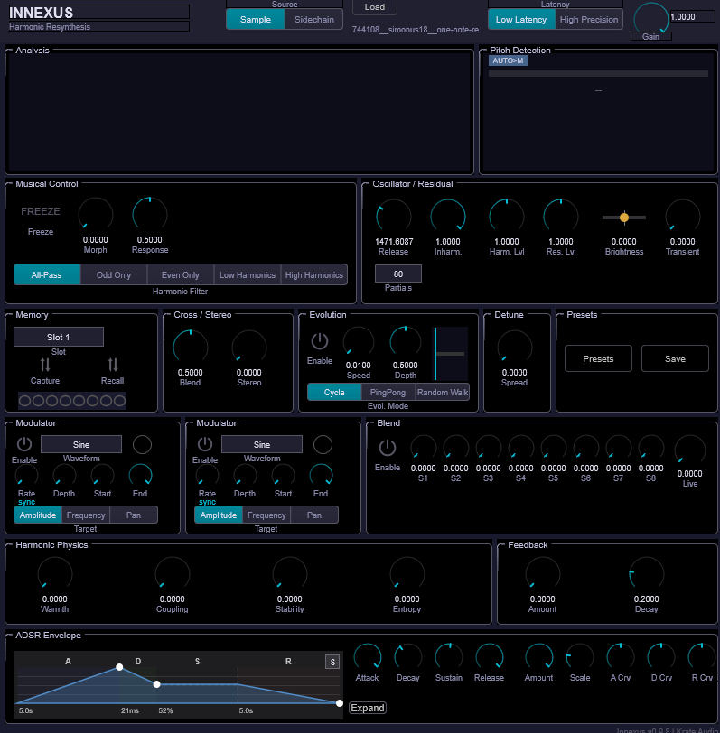

## Introduction

Innexus is a harmonic analysis and resynthesis instrument that deconstructs audio into its fundamental components — pitch, harmonics, and noise — then rebuilds it as a fully playable synthesizer voice. Load a sample or feed live audio through the sidechain, and Innexus extracts up to 96 partials in real time using spectral analysis and pitch tracking. The resulting harmonic model can be frozen, morphed, filtered, modulated, and blended across multiple sources, turning any sound into a rich, evolving instrument.

At its core, Innexus uses a bank of amplitude-stable Gordon-Smith oscillators (48–96 partials) driven by real-time spectral analysis. The analysis pipeline detects fundamental frequencies, tracks individual harmonics, separates tonal content from noise residual, and builds a harmonic model that can be manipulated in ways impossible with conventional sampling or synthesis.

The interface is organized into a single window with clearly labeled sections:

- **Header** — Input source, sample loading, latency mode, and master gain
- **Analysis Display** — Real-time spectral visualization and pitch detection
- **Musical Control** — Freeze, morph, response, and harmonic filtering
- **Oscillator / Residual** — Release time, partial count, inharmonicity, levels, and residual shaping
- **Memory** — 8 harmonic snapshot slots with capture and recall
- **Cross-Synthesis / Stereo** — Timbral blend and stereo spread
- **Evolution Engine** — Autonomous timbral morphing through memory slots
- **Detune / Presets** — Per-partial detuning and preset management
- **Modulators** — Two independent LFOs for per-partial modulation
- **Multi-Source Blend** — Weighted mix of memory slots and live input
- **Harmonic Physics** — Warmth, coupling, stability, and entropy
- **Analysis Feedback** — Self-evolving feedback loop
- **ADSR Envelope** — Auto-detected envelope shaping

### Quick Start

1. Load a sample by clicking the **Load** button in the header (or drag a .wav/.aiff file onto the window)
2. Play MIDI notes — Innexus synthesizes the sample's harmonic content at the played pitch
3. Adjust **Master Gain** and **Harmonic Level** to set the output volume
4. Explore the **Harmonic Filter** to sculpt the spectrum (try Odd Only or Even Only)
5. Use **Freeze** to capture a moment, then sweep **Morph** to blend between frozen and live states
6. Capture harmonic snapshots into **Memory** slots and enable the **Evolution Engine** for autonomous timbral drifting

---

## Signal Flow

Understanding the signal path helps you predict how changes in one section affect the overall sound.

```
Input Source (Sample file or Sidechain audio)
        |
        v
  Pre-Processing (DC removal, 30 Hz high-pass, noise gate)
        |
        v
  Analysis Pipeline (YIN pitch tracking, dual-window STFT, partial tracking)
        |
        v
  Harmonic Model -----> Memory Slots (capture/recall)
        |                     |
        v                     v
  Musical Control         Evolution Engine
  (Freeze, Morph,         (Cycle, PingPong,
   Harmonic Filter)        Random Walk)
        |                     |
        +----------+----------+
                   |
                   v
          Multi-Source Blend (8 slot weights + live weight)
                   |
                   v
          Timbral Blend (pure harmonic series <-> source timbre)
                   |
                   v
          Harmonic Modulators (LFO 1 & 2: amplitude, frequency, pan)
                   |
                   v
          Oscillator Bank (48-96 Gordon-Smith oscillators)
                   |
                   v
          Harmonic Physics (warmth, coupling, stability, entropy)
                   |
        +----------+----------+
        |                     |
        v                     v
  Harmonic Output       Residual Synthesizer
  (Harmonic Level)      (Residual Level, Brightness,
        |                Transient Emphasis)
        |                     |
        +----------+----------+
                   |
                   v
          Stereo Spread + Detune Spread
                   |
                   v
          ADSR Envelope Shaping
                   |
                   v
          Master Gain --> Output
                   |
                   +---> Analysis Feedback Loop (sidechain mode only)
                              |
                              +---> back to Analysis Pipeline
```

MIDI input (notes, velocity, pitch bend) controls the oscillator bank pitch and triggering. The analysis provides the *timbre* (harmonic amplitudes, frequencies, and noise character), while MIDI provides the *musical control* (which notes to play, dynamics, articulation).

---

## Header

<!-- IMG-02: Close-up of the header bar showing the plugin title, source selector, sample load button/filename, latency mode selector, and master gain knob -->


The header is always visible at the top of the plugin window.

| Control | Description |
|---------|-------------|
| **INNEXUS** | Plugin title (left side) |
| **Source** | Input source selector: **Sample** (analyze a loaded audio file) or **Sidechain** (analyze live audio from the DAW's sidechain input) |
| **Load** | Click to load a .wav or .aiff file for analysis. You can also drag and drop files directly onto the plugin window. |
| **Filename** | Displays the name of the currently loaded sample |
| **Latency** | Analysis precision mode: **Low Latency** (11.6 ms processing delay, faster response) or **High Precision** (longer analysis windows, detects fundamentals down to 40 Hz, better frequency resolution) |
| **Gain** | Master output level (0.0–2.0, default 0.8) — controls the final output volume |

---

## Analysis Display

<!-- IMG-03: Close-up of the analysis display section showing the harmonic bar graph on the left with cyan bars representing active partials, and the pitch detection panel on the right showing detected fundamental frequency, note name, and confidence indicator -->
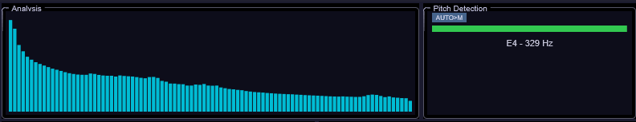

The analysis display section provides real-time visual feedback of what Innexus is hearing and synthesizing.

### Harmonic Display

The left panel shows a bar graph of the amplitude of each detected partial (up to 96 bars depending on the Partial Count setting). Cyan bars indicate active harmonics, and the display updates approximately 30 times per second from the analysis data. This gives you immediate visual feedback of the spectral content being synthesized.

### Pitch Detection

The right panel shows the fundamental frequency detection status:

- **Detected frequency** in Hz and musical note name (e.g., "A3 = 220 Hz")
- **Confidence indicator** — color-coded quality meter (green = high, yellow = medium, red = low)
- **Mode badge** — shows the current analysis mode (MONO, POLY, AUTO>M, or AUTO>P)
- In polyphonic mode, displays up to 8 detected voices with individual confidence bars

---

## Musical Control

<!-- IMG-04: Close-up of the Musical Control section showing the Freeze toggle button, Morph knob, Response knob, and the 5-segment Harmonic Filter selector bar -->
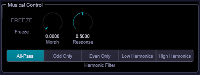

The Musical Control section provides real-time manipulation of the harmonic model.

| Control | Range | Description |
|---------|-------|-------------|
| **Freeze** | On/Off | Captures and holds the current harmonic state as a frozen snapshot. The oscillator bank continues playing from the frozen state. Uses a 10 ms crossfade when disengaging to prevent click artifacts. |
| **Morph** | 0.0–1.0 | Blends between the frozen state (0.0) and live analysis (1.0). Only active when Freeze is engaged. Per-partial amplitude and frequency interpolation with smooth 7 ms filtering to prevent zipper noise. |
| **Response** | 0.0–1.0 | Controls how quickly the live analysis updates (sidechain mode only). 0.0 = slowest/most stable, 1.0 = fastest/most responsive. Default 0.5. |
| **Harmonic Filter** | 5 modes | Per-partial amplitude mask applied after morph, before synthesis. Does not affect the residual noise component. |

### Harmonic Filter Modes

| Mode | Description |
|------|-------------|
| **All-Pass** | No filtering — all partials pass through at full amplitude |
| **Odd Only** | Keeps only odd-numbered harmonics (1st, 3rd, 5th, ...) — creates a hollow, clarinet-like character |
| **Even Only** | Keeps only even-numbered harmonics (2nd, 4th, 6th, ...) — creates a thinner, octave-up quality |
| **Low Harm.** | Emphasizes the fundamental and lower partials; upper harmonics are progressively attenuated |
| **High Harm.** | Emphasizes upper partials; the fundamental is attenuated by 18 dB or more |

**Tip:** Harmonic filters are a quick way to dramatically reshape the timbre without changing the source material. Try Odd Only on a voice sample for an instant reed-like transformation.

---

## Oscillator / Residual

<!-- IMG-05: Close-up of the Oscillator / Residual section showing the Release knob, Partial Count dropdown, Inharmonicity knob, Harmonic Level knob, Residual Level knob, Residual Brightness slider, and Transient Emphasis knob -->
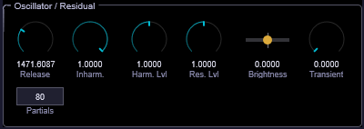

This section controls the synthesis engine's core parameters and the balance between tonal and noise components.

### Oscillator Controls

| Control | Range | Description |
|---------|-------|-------------|
| **Release** | 20–5000 ms | Exponential fade-out time on MIDI note-off. Controls how long harmonics ring out after releasing a key. Short values (20–50 ms) for percussive sounds, longer values (500–5000 ms) for pads. |
| **Partials** | 48 / 64 / 80 / 96 | Number of active oscillators in the resynthesis engine. 48 = efficient, covers fundamental + upper harmonics. 96 = captures more spectral detail including subtle sub-harmonics. Higher counts increase CPU usage. |
| **Inharm.** | 0–100% | Inharmonicity amount. At 100%, the oscillators use the source's exact analyzed frequency deviations (natural for bells, metallic instruments). At 0%, frequencies are forced to a perfect harmonic series (1f, 2f, 3f, ...). Middle values blend between pure and source-derived frequencies. |

### Level Controls

| Control | Range | Description |
|---------|-------|-------------|
| **Harmonic Level** | 0.0–2.0 | Output level of the tonal harmonic content. 0.0 = silence, 1.0 = unity, 2.0 = +6 dB boost. |
| **Residual Level** | 0.0–2.0 | Output level of the noise/residual component (non-harmonic spectral content: breath, fricatives, inharmonic shimmer). 0.0 = pure tones only, 1.0 = balanced mix, 2.0 = emphasis on noisy textures. |
| **Residual Brightness** | -1.0 to +1.0 | Spectral tilt of the residual noise. Negative = darker (sub-harmonic rumble), 0.0 = neutral (matches analysis), positive = brighter (sizzle, air). |
| **Transient Emphasis** | 0.0–2.0 | Boosts or suppresses detected attack transients. 0.0 = no emphasis, 0.5–1.0 = gentle attack shaping, 2.0 = extreme percussive attack. |

**Tip:** For pure, clean tones, set Residual Level to 0.0 and Inharmonicity to 0%. For natural, realistic resynthesis, keep both at their defaults. For lo-fi textures, boost Residual Level and push Transient Emphasis high.

---

## Memory

<!-- IMG-06: Close-up of the Memory section showing the slot selector (1-8), Capture and Recall buttons, and the slot status grid indicating which slots are occupied -->
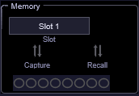

The Memory section lets you capture, store, and recall up to 8 harmonic snapshots. Each snapshot preserves the complete harmonic state (partial amplitudes, frequencies, and ADSR envelope) at the moment of capture.

| Control | Description |
|---------|-------------|
| **Slot** | Selector for the active memory slot (1–8) |
| **Capture** | Saves the current harmonic state into the selected slot. Captures from whatever source is active — post-morph blend, frozen frame, live sidechain, or sample analysis. Can be triggered at any time during playback. |
| **Recall** | Loads the harmonic snapshot from the selected slot. Automatically engages Freeze and loads the recalled state with a click-free crossfade transition. |
| **Slot Status** | Visual grid showing which slots contain saved data. Occupied slots are highlighted; empty slots are grayed out. |

**Tip:** Capture interesting moments during a live performance or while sweeping parameters. You don't need to plan ahead — just capture when you hear something you like, then recall it later or feed the slots into the Evolution Engine.

---

## Cross-Synthesis / Stereo

<!-- IMG-07: Close-up of the Cross-Synthesis / Stereo section showing the Timbral Blend knob and Stereo Spread knob -->
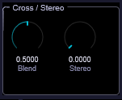

This section controls timbral blending and stereo imaging.

| Control | Range | Description |
|---------|-------|-------------|
| **Timbral Blend** | 0.0–1.0 | Interpolates between a pure harmonic series (0.0) and the analyzed source timbre (1.0). At 0.0, all partials follow a perfect sine series — like FM synthesis. At 1.0, the source's exact spectral content is preserved. Middle values create hybrid cross-synthesized timbres. |
| **Stereo Spread** | 0.0–1.0 | Per-partial stereo panning for decorrelation. At 0.0, all partials are center-panned (mono). At 1.0, odd partials pan left and even partials pan right, with the fundamental reduced to 25%. Values of 0.3–0.7 create a lush, widened stereo image without phasing artifacts. |

**Tip:** Timbral Blend is one of Innexus's most powerful creative controls. Try loading a vocal sample and sweeping Timbral Blend from 1.0 down to 0.0 — you'll hear the voice gradually transform into a pure organ-like tone while retaining the pitch content.

---

## Evolution Engine

<!-- IMG-08: Close-up of the Evolution Engine section showing the Enable toggle, Speed knob, Depth knob, Mode selector, and the position indicator dot -->
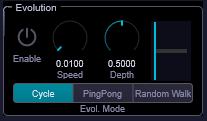

The Evolution Engine provides autonomous timbral morphing by smoothly interpolating between occupied memory slots over time. It runs continuously (not synced to MIDI notes), creating slow, evolving textures.

| Control | Range | Description |
|---------|-------|-------------|
| **Enable** | On/Off | Activates autonomous morphing between occupied memory slots |
| **Speed** | 0.01–10.0 Hz | Rate of evolution. 0.01 Hz = 100 seconds per cycle, 0.1 Hz = 10 seconds, 1.0 Hz = 1 second, 10.0 Hz = chaotic rapid morphing. |
| **Depth** | 0.0–1.0 | How deeply to explore the morph range between waypoints. 0.0 = nearly static, 0.5 = balanced exploration, 1.0 = maximum morph excursion. |
| **Mode** | 3 modes | Traversal pattern through occupied memory slots |
| **Position** | (visual) | Indicator dot showing the current interpolation position within the evolution cycle |

### Evolution Modes

| Mode | Description |
|------|-------------|
| **Cycle** | 1 → 2 → 3 → 4 → 1 → 2 → ... Linear forward motion, wraps around. |
| **PingPong** | 1 → 2 → 3 → 4 → 3 → 2 → 1 → 2 → ... Bounces back and forth. |
| **Random Walk** | Drifts randomly within the depth range. Unpredictable, organic movement. |

**Tip:** Evolution requires at least 2 occupied memory slots. For best results, capture contrasting timbres — e.g., a bright attack moment and a dark sustain — then let the engine drift between them at a slow speed (0.05–0.2 Hz) for pad textures.

---

## Detune / Presets

<!-- IMG-09: Close-up of the Detune / Presets section showing the Detune Spread knob, the Preset Browser button, and the Save Preset button -->
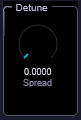

### Detune Spread

| Control | Range | Description |
|---------|-------|-------------|
| **Detune Spread** | 0.0–1.0 | Per-partial frequency offset for chorus-like richness. Odd partials detune positive, even partials detune negative. The fundamental is excluded (less than 1 cent deviation). 0.0 = no detune, 0.2–0.5 = subtle thickness, 1.0 = extreme detuning with bell-like ensemble character. |

### Preset Management

| Control | Description |
|---------|-------------|
| **Preset Browser** | Opens an overlay with 35 factory presets organized across 7 categories: Voice, Strings, Keys, Brass & Winds, Drums & Perc, Pads, and Found Sound (5 each). Search and filter by name, load with one click. |
| **Save** | Opens a dialog to save the current state as a user preset, including all parameter values and memory slot contents. |

---

## Modulators

<!-- IMG-10: Close-up of the two Modulator panels (Modulator 1 and Modulator 2) side by side, showing the Enable toggle, Waveform selector, Rate knob, Depth knob, Range Start/End knobs, and Target selector -->
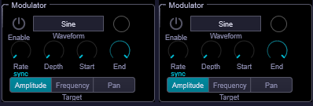

Two independent LFO modulators provide per-partial animation. Each modulator applies its waveform to a selectable range of partials, targeting amplitude, frequency, or pan.

### Per-Modulator Controls

| Control | Range | Description |
|---------|-------|-------------|
| **Enable** | On/Off | Activates this modulator |
| **Waveform** | 5 shapes | Sine, Triangle, Square, Saw, or Random S&H (sample-and-hold noise) |
| **Rate** | 0.01–20.0 Hz | LFO frequency. Can be free-running (Hz) or tempo-synced (note values). |
| **Rate Sync** | On/Off | When on, the Rate knob switches to note values (1/64T through 4/1D). When off, Rate is in free Hz. |
| **Depth** | 0.0–1.0 | How much the LFO modulates the target. 0.0 = no modulation, 1.0 = maximum. |
| **Range Start** | 1–96 | First partial affected by this modulator |
| **Range End** | 1–96 | Last partial affected by this modulator. Only partials between Start and End are modulated. |
| **Target** | 3 modes | What the LFO modulates |

### Modulation Targets

| Target | Description |
|--------|-------------|
| **Amplitude** | Multiplicative modulation — partials get quieter and louder rhythmically. Unipolar (0 to 1). |
| **Frequency** | Additive pitch modulation in cents (up to ±50 cents). Creates vibrato and pitch wobble effects. Bipolar. |
| **Pan** | Stereo position offset (up to ±0.5). Partials drift left and right. Bipolar. |

**Tip:** Set Modulator 1 to target Amplitude on partials 1–16 at a slow rate (0.1 Hz), and Modulator 2 to target Pan on partials 17–96 at a different rate. This creates independent movement in the low and high harmonic ranges for complex, organic textures. When two modulators overlap the same partial range and target, their effects combine (multiply for amplitude, add for frequency/pan).

---

## Multi-Source Blend

<!-- IMG-11: Close-up of the Multi-Source Blend section showing the Enable toggle, the 8 small slot weight knobs (with some set to non-zero values), and the Live Weight knob -->
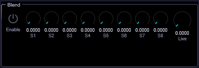

The Multi-Source Blend section provides a weighted mix of memory slots and live input, allowing hybrid timbres from multiple captured states simultaneously.

| Control | Range | Description |
|---------|-------|-------------|
| **Enable** | On/Off | Activates blend mode. When on, overrides normal recall/freeze/evolution. |
| **Slot 1–8** | 0.0–1.0 each | Individual weight for each memory slot. Only occupied slots contribute (empty slots add nothing). Weights are automatically normalized so that total output level stays consistent. |
| **Live** | 0.0–1.0 | Weight of the live sidechain/sample analysis input. 0.0 = only recalled memories, 1.0 = only live input, 0.5 = 50/50 blend. |

**Tip:** Set Slot 1 to 0.7 and Slot 3 to 0.3 for a 70/30 blend of two captured timbres. Add a small Live weight (0.1) to keep the blend responsive to the input. All-zero weights produce silence.

---

## Harmonic Physics

<!-- IMG-12: Close-up of the Harmonic Physics section showing the four knobs: Warmth, Coupling, Stability, and Entropy -->
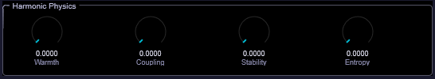

The Harmonic Physics section makes harmonics behave like a coupled physical system rather than independent sine waves. These four parameters add organic, instrument-like character to the resynthesis.

| Control | Range | Description |
|---------|-------|-------------|
| **Warmth** | 0.0–1.0 | Soft saturation applied to partial amplitudes. Compresses dominant partials and relatively boosts quiet ones. 0.0 = linear (clean), 0.5 = gentle warmth with 2–3 dB compression on peaks, 1.0 = pronounced saturation with a vintage tube-like character. Output energy is guaranteed not to exceed input. |
| **Coupling** | 0.0–1.0 | Nearest-neighbor energy sharing between adjacent harmonics. Creates spectral viscosity where partials influence each other. 0.0 = independent partials, 0.5 = moderate smoothing, 1.0 = strong coupling where harmonics blend together and lose individual clarity. Energy is conserved within 0.001%. |
| **Stability** | 0.0–1.0 | Inertia for partial amplitude changes. 0.0 = responsive (tracks input instantly), 0.5 = moderate damping (smooths out rapid changes), 1.0 = extreme lag where old amplitudes are heavily preserved. Reinforces persistent partials and resists transient noise. |
| **Entropy** | 0.0–1.0 | Natural decay rate of partials. 0.0 = partials sustain indefinitely, 0.5 = gentle decay over approximately 10 analysis frames, 1.0 = rapid decay where ghost partials vanish quickly. Useful for clearing transient noise that doesn't persist in the input. |

**Tip:** Warmth + Coupling together simulate the nonlinear, coupled nature of real acoustic instruments. Try moderate values of both (0.3–0.5) on a piano or voice sample for added realism. High Stability (0.7+) paired with low Entropy (0.1) creates a very smooth, slowly evolving tone that resists changes — great for ambient drones.

---

## Analysis Feedback

<!-- IMG-13: Close-up of the Analysis Feedback section showing the Feedback Amount knob and Feedback Decay knob -->
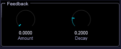

The Analysis Feedback loop feeds the synthesizer's output back into its own analysis pipeline, creating emergent, self-evolving harmonic behavior. This is available in sidechain mode only.

| Control | Range | Description |
|---------|-------|-------------|
| **Feedback Amount** | 0.0–1.0 | Mix ratio of synth output fed back into the analysis input. 0.0 = normal operation, 0.3–0.5 = gentle self-reinforcement (resonant, rich), 1.0 = full feedback (can create chaotic states). A built-in soft limiter prevents clipping. |
| **Feedback Decay** | 0.0–1.0 | Exponential entropy leak in the feedback buffer. 0.0 = no decay (feedback persists), 0.2 = moderate decay (stale signal fades over ~10 seconds), 1.0 = rapid decay (only recent feedback survives, ~1 second memory). Behaves consistently regardless of block size or sample rate. |

### Safety

The feedback loop includes a 5-layer safety stack: soft limiter, energy budget normalization, hard clamp, confidence gate, and decay. It is automatically bypassed when Freeze is engaged, and the feedback buffer is cleared when Freeze is disengaged to prevent stale contamination.

**Tip:** Start with very low Feedback Amount (0.1–0.2) and moderate Decay (0.3). The effect is subtle at first — harmonics that the synth produces get re-analyzed, reinforcing certain partials and creating resonant, self-similar textures. Higher values create more chaotic, unpredictable behavior that can be musically interesting but needs careful management.

---

## ADSR Envelope

<!-- IMG-14: Close-up of the ADSR Envelope section showing the envelope display graph, the Attack/Decay/Sustain/Release knobs, the Amount knob, Time Scale knob, and the three curve shape knobs (Attack Curve, Decay Curve, Release Curve) -->
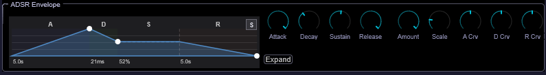

Innexus auto-detects the amplitude envelope of loaded samples and allows real-time editing. The envelope shapes the synthesized output, making it respond dynamically to note events rather than producing a flat sustain.

### Envelope Display

The visual graph shows the detected or edited envelope shape with interactive drag points. A playback dot tracks the current envelope stage in real time. Click the **Expand** button for a full-window overlay with detailed envelope editing.

### Envelope Parameters

| Control | Range | Description |
|---------|-------|-------------|
| **Attack** | 1–5000 ms | Time from note-on to peak amplitude. Auto-detected from the sample's leading edge. 1 ms = percussive click, 10 ms = standard, 500 ms = smooth pad entry. |
| **Decay** | 1–5000 ms | Time from peak to sustain level. Detected from the sample's post-attack settling. |
| **Sustain** | 0.0–1.0 | Level held while the MIDI note is pressed. 1.0 = full amplitude, 0.0 = silence after decay. |
| **Release** | 1–5000 ms | Time from note-off to silence. Detected from the sample's tail decay. |
| **Amount** | 0.0–1.0 | Blend between the detected envelope (1.0) and no envelope shaping (0.0). Automatically enabled when envelope detection runs on sample load. |

### Shaping Controls

| Control | Range | Description |
|---------|-------|-------------|
| **Time Scale** | 0.25–4.0x | Multiplies all time parameters uniformly. 0.25x = 4x faster (snappier), 1.0x = original, 4.0x = 4x slower (more spacious). |
| **Attack Curve** | -1.0 to +1.0 | Shape of the attack ramp. -1.0 = exponential (slow start, fast finish), 0.0 = linear, +1.0 = logarithmic (fast start, slow finish). |
| **Decay Curve** | -1.0 to +1.0 | Shape of the decay from peak to sustain. Same curve range as attack. |
| **Release Curve** | -1.0 to +1.0 | Shape of the release from sustain to silence. Same curve range as attack. |

**Tip:** The auto-detected envelope is a great starting point. For a drum sample, you'll get a fast attack and short decay automatically. To make it more playable as a pad, increase Time Scale to 2.0–4.0x to stretch the envelope out, and raise Sustain to keep the sound alive while keys are held.

---

## Tips & Techniques

### From Sample to Playable Instrument

The most basic Innexus workflow: load a sample, play MIDI. The plugin uses the sample's timbre as the "DNA" for your synthesized sound. Short samples work as well as long ones — Innexus analyzes the harmonic content, not the waveform directly. A single piano chord can become a rich, evolving pad.

### Freeze as a Creative Tool

Freeze isn't just for "pausing" — it's a performance tool. Engage Freeze to lock in a particular harmonic moment, then use Morph to blend between that frozen state and whatever the live input is doing. This creates a tension-and-release dynamic where the timbre alternates between a known reference point and live variation.

### Memory Slot Workflows

- **Performance snapshots**: Capture 4–5 different timbral states before a performance, then recall them on the fly during playback
- **Evolution fuel**: Populate all 8 slots with contrasting timbres (bright attack, dark sustain, noise-heavy, pure tone, etc.), then enable Evolution for endlessly shifting textures
- **Cross-synthesis palette**: Use Multi-Source Blend with weighted slots to create timbres that don't exist in any single source

### Feedback for Self-Evolving Textures

The Analysis Feedback loop is unique to Innexus. Unlike a delay or reverb, it creates a self-referential system where the synth's own output influences what it "hears" and therefore what it produces. At low amounts (0.1–0.3), this creates subtle resonant reinforcement. At higher amounts, the system can enter attractor states — stable-but-complex patterns that evolve organically.

### Harmonic Physics for Realism

Real acoustic instruments have nonlinear, coupled vibrating systems — strings influence each other, resonant bodies add warmth, energy dissipates naturally. The Harmonic Physics section approximates these behaviors:

- **Warmth** acts like a resonant body (soft saturation)
- **Coupling** acts like sympathetic string resonance (energy sharing)
- **Stability** acts like physical mass (inertia, resistance to change)
- **Entropy** acts like air damping (natural decay)

### Modulators for Animation

Use the two modulators to add life to static timbres. Some effective setups:

- **Slow amplitude mod on low partials** (Rate 0.05 Hz, Depth 0.3, Range 1–8, Target Amplitude) — subtle breathing effect
- **Medium frequency mod on high partials** (Rate 2 Hz, Depth 0.2, Range 32–96, Target Frequency) — shimmer and sparkle
- **Tempo-synced pan mod** (Rate 1/8 note, Depth 0.5, Full range, Target Pan) — rhythmic stereo movement

### CPU Management

If CPU usage is high:
- Reduce **Partial Count** from 96 to 48 — the difference is often subtle
- Disable unused **Modulators**
- Turn off **Evolution Engine** when not needed
- Reduce **Feedback Amount** to 0 when not using the feedback loop
- In sidechain mode, use **Low Latency** mode unless you need bass precision

### Drag and Drop

Drag .wav or .aiff files directly onto the Innexus window. The plugin provides visual feedback during the drag operation and begins analysis immediately after the drop. No file dialogs needed.
