# Ruinae — User Manual

<!-- IMG-01: Full screenshot of Ruinae with the Sound tab active, showing the complete plugin window -->
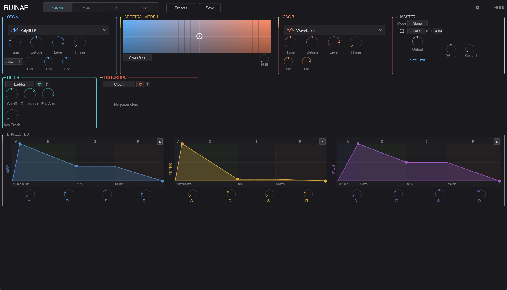

## Introduction

Ruinae is a chaos/spectral hybrid synthesizer built for sound designers, electronic musicians, and anyone who wants to explore territory beyond conventional synthesis. It combines ten distinct oscillator types — from classic analog-modeled waveforms to chaotic attractors and particle clouds — with spectral morphing, a flexible modulation system, and a deep effects chain.

At its core, Ruinae is a 16-voice polyphonic instrument. Each voice runs two oscillators through a mixer that can perform either simple crossfading or FFT-based spectral morphing. The signal then passes through a filter, distortion stage, optional trance gate, and amplitude envelope before being summed to stereo and fed through a global effects chain.

The interface is organized into four tabs:

- **SOUND** — Oscillators, mixer, filter, distortion, envelopes, and master controls
- **MOD** — Modulation sources (LFOs, chaos, macros, and more) and an 8-slot modulation matrix
- **FX** — Phaser, delay, harmonizer, reverb, and a global filter
- **SEQ** — Trance gate and a full-featured 32-step arpeggiator

### Quick Start

1. Load a preset from the preset browser (click the preset name in the top bar)
2. Play some notes — Ruinae defaults to polyphonic mode with 8 voices
3. Explore the Sound tab to shape the basic timbre
4. Head to the Mod tab to add movement
5. Use the FX tab for spatial processing
6. Try the SEQ tab for rhythmic patterns and arpeggiation

---

## Signal Flow

Understanding the signal path helps you predict how changes in one section affect the overall sound.

```
Per Voice:
  OSC A ──┐
           ├──> Mixer ──> Filter ──> Distortion ──> DC Blocker ──> Trance Gate ──> VCA
  OSC B ──┘     (Crossfade or                                      (Rhythmic      (Amp
                 Spectral Morph)                                    gating)        Envelope)

Global:
  All Voices ──> Stereo Pan + Sum ──> Stereo Width ──> Global Filter
    ──> Phaser ──> Delay ──> Harmonizer ──> Reverb
    ──> Master Gain ──> Soft Limiter ──> Output
```

Each voice produces a mono signal. Voices are panned and summed to stereo, then processed through the shared effects chain. Master gain is automatically compensated based on the number of active voices (1/√N scaling) so the output level stays consistent whether you play one note or a full chord.

---

## Top Bar

<!-- IMG-02: Close-up of the top bar showing the plugin title, tab selector, preset controls, and settings gear -->


The top bar is always visible regardless of which tab is active.

- **RUINAE** — Plugin title (left side)
- **SOUND | MOD | FX | SEQ** — Tab selector to switch between the four main sections
- **Preset Browser** — Click the preset name to browse and load presets. Use the left/right arrows to step through presets sequentially.
- **Save** — Save the current settings as a preset
- **Settings Gear** — Opens the settings drawer (see [Settings](#settings) below)
- **Version** — Current plugin version (right side)

---

## Sound Tab

The Sound tab is where you build the fundamental timbre. It's divided into three rows: sound sources (oscillators and mixer), timbre shaping (filter and distortion), and dynamics (envelopes).

<!-- IMG-03: Full screenshot of the Sound tab showing all three rows -->
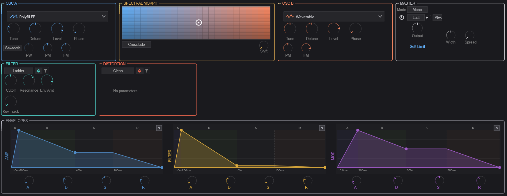

---

### OSC A

<!-- IMG-04: Close-up of the OSC A container, showing the type selector, main knobs, and type-specific parameter area -->
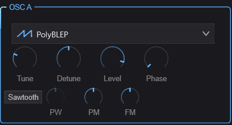

OSC A is the first of two oscillators in each voice. It provides ten synthesis types, each with its own character and set of controls.

#### Common Controls

These four knobs are available regardless of which oscillator type is selected:

| Control | Range | Description |
|---------|-------|-------------|
| **Tune** | -24 to +24 st | Coarse tuning in semitones relative to the played note |
| **Detune** | -100 to +100 ct | Fine tuning in cents for subtle detuning effects |
| **Level** | 0–100% | Output level of this oscillator before the mixer |
| **Phase** | 0–360° | Starting phase of the oscillator waveform on each note |

#### Oscillator Types

Select the synthesis type from the dropdown menu at the top of the OSC A container. Each type reveals a different set of controls in the area below the common knobs.

##### PolyBLEP

Classic analog-modeled waveforms using band-limited polynomial synthesis. Clean, anti-aliased, and CPU-efficient.

| Control | Description |
|---------|-------------|
| **Waveform** | Sine, Triangle, Sawtooth, Square, or Pulse |
| **Pulse Width** | Width of the pulse waveform (0.01–0.99). Only audible with Pulse waveform. At 0.5, this produces a square wave. |
| **Phase Mod** | Phase modulation depth — modulates the oscillator's phase for FM-like timbres |
| **Freq Mod** | Frequency modulation depth |

##### Wavetable

Wavetable synthesis that scans through a table of waveforms for evolving timbres.

| Control | Description |
|---------|-------------|
| **Phase Mod** | Phase modulation depth |
| **Freq Mod** | Frequency modulation depth |

##### Phase Distortion

Inspired by Casio CZ-series synthesis. Distorts the phase of a waveform to create harmonically rich timbres from simple starting shapes.

| Control | Description |
|---------|-------------|
| **Waveform** | Base waveform to apply phase distortion to |
| **Distortion** | Amount of phase distortion — higher values create more harmonics |

##### Sync

Hard-sync oscillator where a slave oscillator is reset by a master, creating the classic sync sweep sound.

| Control | Description |
|---------|-------------|
| **Ratio** | Frequency ratio between master and slave oscillators |
| **Waveform** | Slave oscillator waveform shape |
| **Mode** | Sync behavior mode |
| **Amount** | Blend between synced and free-running slave |
| **Pulse Width** | Pulse width of the slave waveform |

##### Additive

Builds sounds from individual harmonics (sine partials). Great for bell-like, organ, and evolving pad sounds.

| Control | Description |
|---------|-------------|
| **Partials** | Number of harmonic partials (more partials = richer spectrum) |
| **Tilt** | Spectral tilt — controls the rolloff slope of higher harmonics. Positive values brighten, negative values darken. |
| **Inharmonicity** | Stretches the harmonic series. At 0, partials are perfectly harmonic. Higher values shift partials away from integer multiples, creating bell-like or metallic tones. |

##### Chaos

Generates audio from mathematical chaotic attractors — the Lorenz and Rössler systems. These produce complex, unpredictable waveforms that hover between tone and noise.

| Control | Description |
|---------|-------------|
| **Attractor** | Selects the chaotic system (Lorenz or Rössler) |
| **Amount** | Chaos intensity — how far the system is driven into chaotic behavior |
| **Coupling** | How tightly the chaos output is coupled to the oscillator frequency |
| **Output** | Which axis of the attractor to use as audio (X, Y, or Z — each has a different character) |

##### Particle

A cloud of short-lived micro-oscillators (particles) that are continuously spawned, creating granular textures from oscillator-level synthesis.

| Control | Description |
|---------|-------------|
| **Scatter** | How far particles deviate in pitch from the fundamental |
| **Density** | Number of particles spawned per second |
| **Lifetime** | How long each particle lives before fading out |
| **Spawn Mode** | Pattern for spawning new particles |
| **Env Type** | Envelope shape applied to each particle's amplitude |
| **Drift** | Amount of random pitch drift over each particle's lifetime |

##### Formant

Generates vowel-like sounds by emphasizing formant frequencies. Useful for vocal pads, choir textures, and talking synth effects.

| Control | Description |
|---------|-------------|
| **Vowel** | Selects the target vowel formant (A, E, I, O, U and blends between them) |
| **Morph** | Smoothly morphs between adjacent vowel shapes |

##### Spectral Freeze

Captures and freezes a spectral snapshot, then allows you to manipulate the frozen spectrum in real time.

| Control | Description |
|---------|-------------|
| **Pitch** | Pitch-shifts the frozen spectrum up or down |
| **Tilt** | Tilts the spectral balance (brightens or darkens the frozen sound) |
| **Formant** | Shifts formant positions independently of pitch |

##### Noise

Generates various colors of noise, useful as a sound source for percussive textures, wind effects, or as a modulation source blended with the other oscillator.

| Control | Description |
|---------|-------------|
| **Color** | Noise type: White (flat spectrum), Pink (-3dB/octave), Brown (-6dB/octave), Blue (+3dB/octave), Violet (+6dB/octave), or Grey (perceptually flat) |

---

### Spectral Morph

<!-- IMG-05: Close-up of the Spectral Morph container, showing the XY morph pad with the blue-to-orange gradient, mode dropdown, and shift knob -->
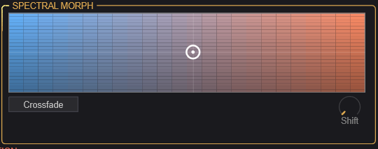

The Spectral Morph section sits between the two oscillators and controls how they are blended together. This is where Ruinae's hybrid character really shines.

#### XY Morph Pad

The large 2D pad is the central mixing control:

- **X-axis (horizontal)** — Mix Position: Blends between OSC A (left) and OSC B (right)
- **Y-axis (vertical)** — Spectral Tilt: Tilts the spectral balance of the mix. Moving up brightens the sound by boosting high frequencies; moving down darkens it.

Click and drag anywhere on the pad to set both parameters simultaneously. The gradient coloring (blue on the left for OSC A, orange on the right for OSC B) provides a visual reference.

#### Controls

| Control | Description |
|---------|-------------|
| **Mode** | **Crossfade**: Simple amplitude crossfade between OSC A and B. **Spectral Morph**: FFT-based morphing that blends the spectral content of both oscillators, creating hybrid timbres impossible with simple mixing. |
| **Shift** | Spectral frequency shift — shifts all frequencies up or down by a fixed amount (not pitch-shifting). Creates inharmonic, metallic textures. |

**Tip:** Spectral Morph mode is most interesting when the two oscillators use different synthesis types. Try a PolyBLEP sawtooth on OSC A and a Chaos attractor on OSC B, then sweep the morph pad to find the sweet spot.

---

### OSC B

<!-- IMG-06: Close-up of the OSC B container (can be omitted if the layout is identical to OSC A — reference the OSC A screenshot instead) -->
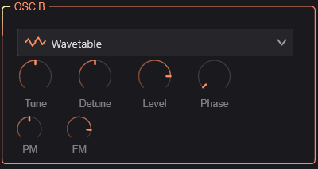

OSC B is identical in structure to OSC A — it has the same ten synthesis types and the same common controls (Tune, Detune, Level, Phase). The two oscillators are independent: you can use the same type on both or mix completely different synthesis methods.

**Tip:** For classic detuned pads, use the same type on both oscillators with slightly different Detune values. For more experimental sounds, combine contrasting types (e.g., Additive + Particle, or Formant + Chaos).

---

### Master

<!-- IMG-07: Close-up of the Master container, showing the voice mode dropdown, output/width/spread knobs, and soft limit toggle -->
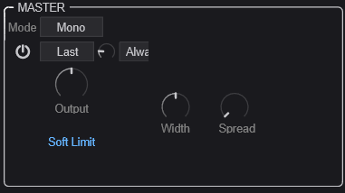

The Master section controls global voice behavior and output characteristics.

#### Voice Mode

| Control | Description |
|---------|-------------|
| **Mode** | **Poly**: Polyphonic — each note gets its own voice. **Mono**: Monophonic — only one note sounds at a time. |
| **Polyphony** | (Poly mode only) Maximum number of simultaneous voices, from 1 to 16. Lower values save CPU. |

#### Mono Mode Controls

When Mono mode is selected, additional controls appear:

| Control | Description |
|---------|-------------|
| **Legato** | When enabled, overlapping notes don't retrigger envelopes — they just change the pitch. Creates smooth, connected phrases. |
| **Priority** | Which note wins when multiple keys are held: Last, Low, or High |
| **Portamento** | Glide time between notes (0 = instant, higher = slower glide) |
| **Port. Mode** | **Always**: Glide on every note. **Legato**: Only glide when notes overlap. |

#### Output Controls

| Control | Description |
|---------|-------------|
| **Output** | Master output level |
| **Width** | Stereo width (0–200%). At 0% the output is mono, 100% is normal stereo, above 100% exaggerates the stereo field. |
| **Spread** | Voice stereo spread (0–100%). Distributes voices across the stereo field. At 0%, all voices are centered. |
| **Soft Limit** | When enabled, applies a gentle tanh saturation to prevent harsh digital clipping on the master output. Recommended to keep on. |

---

### Filter

<!-- IMG-08: Close-up of the Filter container, showing the filter type dropdown, the general/type-specific toggle, and the parameter area. Show the General view. -->
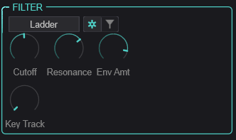

The filter shapes the timbre of each voice after the oscillators are mixed. Six filter types are available, each with shared "general" parameters and type-specific controls.

Use the toggle button (gear icon) to switch between the **General** view (common parameters) and the **Type-Specific** view (parameters unique to the selected filter type).

#### General Parameters

These apply to all filter types:

| Control | Range | Description |
|---------|-------|-------------|
| **Cutoff** | 20–20,000 Hz | Filter cutoff frequency |
| **Resonance** | 0–100% | Emphasis at the cutoff frequency. High values create a ringing peak. |
| **Env Amount** | -48 to +48 st | How much the Filter Envelope (ENV 2) modulates the cutoff frequency, in semitones. Positive values open the filter with the envelope; negative values close it. |
| **Key Track** | 0–100% | How much the cutoff follows the played note. At 100%, the filter tracks the keyboard perfectly (useful for self-oscillating filter melodies). |

#### Filter Types

##### SVF (State Variable Filter)

A versatile 12dB/octave filter with multiple response modes.

| Control | Description |
|---------|-------------|
| **Sub-Type** | Low Pass, High Pass, Band Pass, Notch, Peak, All Pass, Low Shelf, or High Shelf |

##### Ladder

Modeled after the classic Moog-style transistor ladder filter. Warm, fat, with a characteristic resonance that thins the bass at high settings.

| Control | Description |
|---------|-------------|
| **Slope** | Filter steepness: 1-pole (6dB), 2-pole (12dB), 3-pole (18dB), or 4-pole (24dB/oct) |
| **Drive** | Input drive (0–24 dB) — overdrives the filter input for saturation |

##### Formant

A filter that emphasizes vowel-like resonant peaks, independent of the Formant oscillator type.

| Control | Description |
|---------|-------------|
| **Morph** | Blends between vowel shapes |
| **Gender** | Shifts formant frequencies up (feminine) or down (masculine) |

##### Comb

A comb filter that creates metallic, pitched resonance effects by feeding back a short delay.

| Control | Description |
|---------|-------------|
| **Feedback** | Feedback amount — higher values create stronger resonant peaks |
| **Damping** | High-frequency damping in the feedback path |

##### Envelope Filter

An auto-wah style filter where the cutoff responds dynamically to the input signal level.

| Control | Description |
|---------|-------------|
| **Sensitivity** | How responsive the filter is to input level changes |
| **Speed** | How quickly the filter follows the input envelope |

##### Self-Oscillating

A resonant filter pushed into self-oscillation — it generates its own pitched tone at the cutoff frequency. The input signal modulates this self-oscillation for unusual timbres.

| Control | Description |
|---------|-------------|
| **Feedback** | Self-oscillation intensity |
| **Character** | Tonal character of the self-oscillation |

---

### Distortion

<!-- IMG-09: Close-up of the Distortion container, showing the type dropdown, general/type-specific toggle, and parameter area. Show the General view. -->
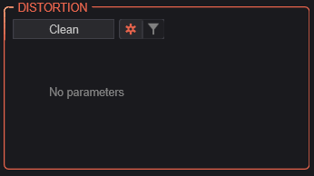

The distortion stage comes after the filter in each voice's signal path. Seven distortion types range from subtle warmth to extreme spectral destruction.

Like the filter, use the toggle button to switch between **General** and **Type-Specific** views.

#### General Parameters

| Control | Description |
|---------|-------------|
| **Drive** | Distortion intensity (0–100%) |
| **Character** | Reserved for future use |
| **Mix** | Dry/wet blend (0–100%). Allows parallel distortion. |

#### Distortion Types

##### Clean

Bypass — no distortion applied. Select this when you want a clean signal path.

##### Chaos

Drives the signal through a chaotic waveshaper based on the Lorenz or Rössler attractor system. Creates unpredictable, evolving distortion.

| Control | Description |
|---------|-------------|
| **Model** | Chaotic attractor type |
| **Speed** | Rate of chaotic evolution |
| **Coupling** | How tightly the input signal influences the chaotic system |

##### Spectral

Applies distortion in the frequency domain using FFT processing. Can create harmonics, spectral smearing, and bit-reduction effects that are impossible with time-domain waveshaping.

| Control | Description |
|---------|-------------|
| **Mode** | Spectral distortion algorithm |
| **Curve** | Shape of the spectral transfer function |
| **Bits** | Spectral bit depth — lower values create stepped, lo-fi spectral artifacts |

##### Granular

Micro-grain distortion that chops the signal into tiny grains and reassembles them with controlled randomness. Creates textures ranging from subtle grit to complete disintegration.

| Control | Description |
|---------|-------------|
| **Size** | Grain size — smaller grains create more extreme effects |
| **Density** | Grain density (grains per second) |
| **Variation** | Amount of random variation in grain parameters |
| **Jitter** | Timing randomness between grains |

##### Wavefolder

Folds the waveform back on itself when it exceeds a threshold, adding rich odd and even harmonics. A classic technique from West Coast synthesis.

| Control | Description |
|---------|-------------|
| **Type** | Wavefolding algorithm/shape |

##### Tape

Models the saturation characteristics of magnetic tape recording. Adds warmth, compression, and subtle harmonics.

| Control | Description |
|---------|-------------|
| **Model** | Tape machine type/era |
| **Saturation** | Tape saturation amount |
| **Bias** | Tape bias setting — affects the harmonic character of the saturation |

##### Ring Mod

Ring modulation multiplies the signal with an internal oscillator, creating sum and difference frequencies for metallic, bell-like, or atonal effects.

| Control | Description |
|---------|-------------|
| **Frequency** | Ring modulator oscillator frequency |
| **Mode** | Modulation mode |
| **Ratio** | Frequency ratio relative to the played note |
| **Waveform** | Modulator waveform shape |
| **Stereo Spread** | Stereo decorrelation between left and right channels |

---

### Envelopes

<!-- IMG-10: Close-up of the Envelopes row showing all three envelope displays (AMP, FILTER, MOD) side by side with their ADSR knobs -->
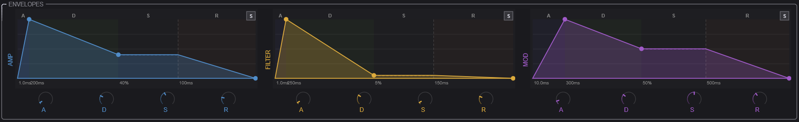

Three ADSR envelopes control the dynamics and modulation of each voice. Each envelope has the same set of controls but serves a different purpose:

- **AMP (ENV 1)** — Controls the volume contour of each voice. This is always active.
- **FILTER (ENV 2)** — Modulates the filter cutoff frequency. The amount is set by the Filter section's Env Amount knob.
- **MOD (ENV 3)** — A general-purpose envelope available as a modulation source in the mod matrix.

#### Controls

Each envelope provides:

| Control | Range | Description |
|---------|-------|-------------|
| **A (Attack)** | 0–10,000 ms | Time from note-on to peak level |
| **D (Decay)** | 0–10,000 ms | Time from peak to sustain level |
| **S (Sustain)** | 0–100% | Level held while the note is sustained |
| **R (Release)** | 0–10,000 ms | Time from note-off to silence |

Each envelope also supports **curve shaping** for the attack, decay, and release segments (accessible via right-click or the envelope display), ranging from logarithmic (fast initial response) to exponential (slow initial response). An optional **Bezier mode** provides even finer control over the envelope shape with draggable control points on the visual display.

**Tip:** For snappy plucks, use very short attack (0–5 ms) and decay (50–200 ms) with zero sustain. For pads, use longer attack (100–500 ms) and high sustain.

---

## Mod Tab

The Mod tab is where you bring your sound to life with movement and variation. The left side houses ten different modulation sources, and the right side provides an 8-slot modulation matrix for routing those sources to destinations throughout the synth.

<!-- IMG-11: Full screenshot of the Mod tab showing the modulation sources panel on the left and the modulation matrix on the right -->
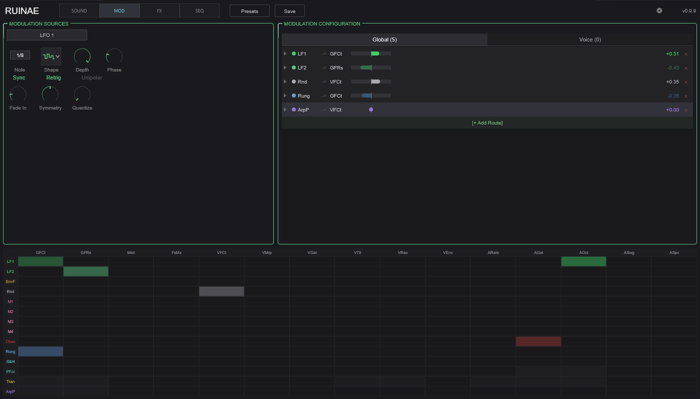

---

### Modulation Sources

<!-- IMG-12: Close-up of the Modulation Sources container with the source selector dropdown open, showing the list of available sources -->
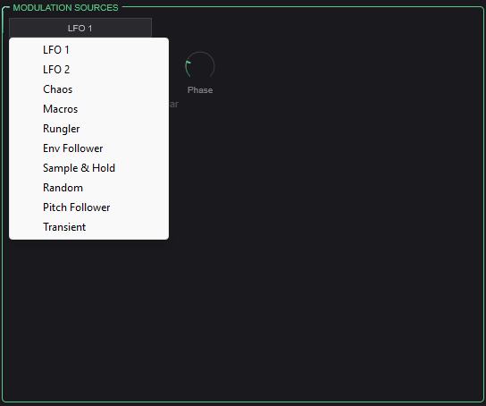

Select a modulation source from the dropdown to view and edit its parameters. Each source generates a control signal that can be routed to any destination via the modulation matrix.

#### LFO 1 & LFO 2

<!-- IMG-13: Close-up of the LFO source view showing rate, shape, and other controls -->
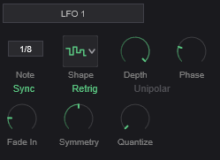

Two independent low-frequency oscillators for cyclic modulation (vibrato, tremolo, filter sweeps, etc.).

| Control | Description |
|---------|-------------|
| **Rate** | LFO speed. 0.01–50 Hz in free mode, or locked to tempo divisions when synced. |
| **Shape** | Waveform: Sine, Triangle, Sawtooth, Square, Sample & Hold (stepped random), or Smooth Random |
| **Depth** | Modulation intensity (0–100%) |
| **Sync** | Lock LFO rate to host tempo |
| **Note Value** | Tempo division when synced (e.g., 1/4 note, 1/8 note, dotted, triplet) |
| **Phase** | Starting phase offset (0–360°) |
| **Retrigger** | When enabled, LFO restarts from its phase offset on each new note |
| **Unipolar** | When enabled, LFO output ranges from 0 to +1 instead of -1 to +1 |
| **Fade-In** | Time for the LFO to ramp up from zero after a note is triggered. Useful for delayed vibrato. |
| **Symmetry** | Skews the waveform — e.g., turns a triangle into a ramp |
| **Quantize** | Snaps the LFO output to discrete steps (0 = smooth, 2–16 = number of steps) |

#### Chaos Mod

<!-- IMG-14: Close-up of the Chaos modulation source view -->
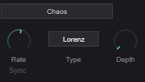

A modulation source driven by a chaotic attractor system, producing complex, non-repeating patterns that are more organic than LFOs but more structured than random.

| Control | Description |
|---------|-------------|
| **Rate** | Speed of the chaotic system's evolution |
| **Type** | Attractor model (Lorenz or Rössler) |
| **Depth** | Output intensity |
| **Sync** | Lock to host tempo |
| **Note Value** | Tempo division when synced |

#### Macros

<!-- IMG-15: Close-up of the Macros source view showing the four macro knobs -->
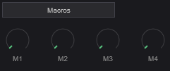

Four user-assignable macro knobs that provide direct, hands-on control. Assign a macro as a modulation source in the matrix, then use the knob to manually sweep the modulation amount in real time. Great for performance control and MIDI CC mapping.

| Control | Description |
|---------|-------------|
| **Macro 1–4** | Four independent control values (0–100%) |

#### Rungler

<!-- IMG-16: Close-up of the Rungler source view -->
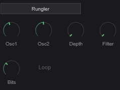

Inspired by the Benjolin circuit, the Rungler is a shift-register based pattern generator that produces semi-random, repeating stepped patterns. It uses two internal oscillators whose interaction feeds a digital shift register.

| Control | Description |
|---------|-------------|
| **Osc 1 Freq** | Frequency of the first internal oscillator |
| **Osc 2 Freq** | Frequency of the second internal oscillator |
| **Depth** | Output intensity |
| **Filter** | Low-pass filter on the Rungler output for smoothing |
| **Bits** | Number of active bits in the shift register (fewer bits = shorter, more repetitive patterns) |
| **Loop Mode** | When enabled, the shift register loops instead of evolving |

#### Envelope Follower

<!-- IMG-17: Close-up of the Envelope Follower source view -->
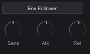

Tracks the amplitude of the audio input signal and converts it to a modulation signal. Useful for making parameters respond to playing dynamics.

| Control | Description |
|---------|-------------|
| **Sensitivity** | Input gain/sensitivity |
| **Attack** | How quickly the follower responds to rising levels |
| **Release** | How quickly the follower responds to falling levels |

#### Sample & Hold

<!-- IMG-18: Close-up of the Sample & Hold source view -->
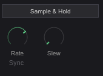

Periodically samples a random value and holds it until the next sample, creating stepped random modulation.

| Control | Description |
|---------|-------------|
| **Rate** | How often a new random value is sampled |
| **Sync** | Lock to host tempo |
| **Note Value** | Tempo division when synced |
| **Slew** | Smoothing between steps — at 0, transitions are instant (classic S&H). Higher values create smooth glides between random values. |

#### Random

<!-- IMG-19: Close-up of the Random source view -->
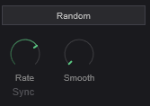

Generates continuous random modulation, either smooth or stepped.

| Control | Description |
|---------|-------------|
| **Rate** | Speed of random change |
| **Sync** | Lock to host tempo |
| **Note Value** | Tempo division when synced |
| **Smoothness** | Interpolation between random values. Low values produce stepped output; high values produce smooth, wandering modulation. |

#### Pitch Follower

<!-- IMG-20: Close-up of the Pitch Follower source view -->
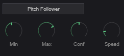

Tracks the pitch of the input signal and converts it to a modulation signal. This allows parameters to respond to what notes are being played.

| Control | Description |
|---------|-------------|
| **Min Hz** | Lowest frequency to track |
| **Max Hz** | Highest frequency to track |
| **Confidence** | Detection confidence threshold — higher values require a clearer pitch to generate output |
| **Speed** | How quickly the follower responds to pitch changes |

#### Transient Detector

<!-- IMG-21: Close-up of the Transient Detector source view -->
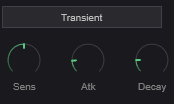

Detects transient attacks in the signal and generates a trigger/envelope in response. Useful for making parameters respond to rhythmic articulation.

| Control | Description |
|---------|-------------|
| **Sensitivity** | Detection threshold — lower values detect softer transients |
| **Attack** | Rise time of the generated envelope |
| **Decay** | Fall time of the generated envelope |

---

### Modulation Matrix

<!-- IMG-22: Close-up of the Modulation Configuration panel showing the 8-slot matrix with source, destination, and amount columns. Show at least 2-3 slots with active routings. -->
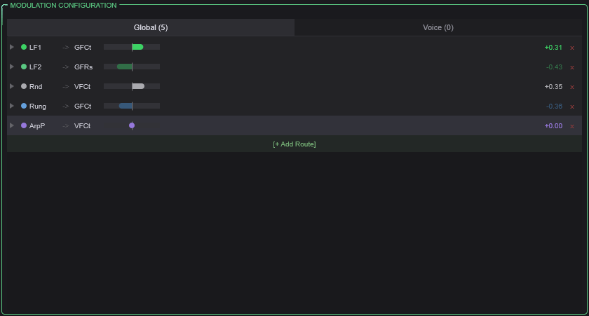

The modulation matrix provides 8 independent routing slots. Each slot connects one source to one destination with a configurable amount.

#### Per-Slot Controls

| Control | Description |
|---------|-------------|
| **Source** | The modulation signal to use (any of the 10 sources listed above, plus the 3 envelopes, velocity, and arp lanes) |
| **Destination** | The parameter to modulate (oscillator parameters, filter cutoff/resonance, distortion drive, mixer position, trance gate, effect parameters, and more) |
| **Amount** | Modulation depth (0–100%) |
| **Curve** | Shapes the modulation response (e.g., linear, exponential, S-curve) |
| **Smooth** | Low-pass filter on the modulation signal to reduce abrupt changes |
| **Scale** | Output scaling factor |
| **Bypass** | Temporarily disable this routing without losing the settings |

#### Available Sources

LFO 1, LFO 2, Chaos, Macro 1–4, Envelope 1 (Amp), Envelope 2 (Filter), Envelope 3 (Mod), Envelope Follower, Sample & Hold, Random, Pitch Follower, Transient Detector, Rungler, Velocity Lane, Gate Lane, Pitch Lane, Modifier Lane, Ratchet Lane, Condition Lane, and the audio signal itself.

#### Key Destinations

Per-voice destinations: OSC A/B Pitch, OSC A/B Level, Filter Cutoff, Filter Resonance, Morph Position, Spectral Tilt, Distortion Drive, Trance Gate Depth

Global destinations: Global Filter Cutoff/Resonance, Master Volume, Effect Mix, Arp Rate/Gate/Octave/Swing/Spice

**Tip:** Use the category tabs at the top of the matrix to filter destinations by section (oscillators, filter, effects, etc.), making it easier to find the parameter you want.

### Mod Heatmap

<!-- IMG-23: Close-up of the Mod Heatmap at the bottom of the Mod tab, ideally with some active modulation routing so the heatmap shows activity -->
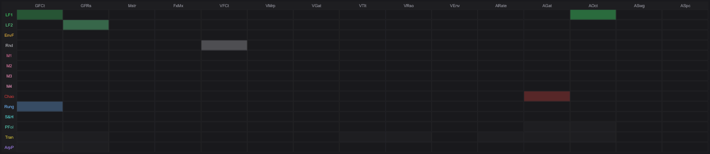

The mod heatmap at the bottom of the tab provides a visual overview of all active modulation routing. Brighter cells indicate stronger modulation. This helps you quickly see which parameters are being modulated and by how much.

---

## FX Tab

The FX tab contains the global effects chain that processes the summed output of all voices. Effects are processed in a fixed order: Phaser → Delay → Harmonizer → Reverb. Each effect can be independently enabled or bypassed.

<!-- IMG-24: Full screenshot of the FX tab showing all four effect sections and the global filter strip at the top -->
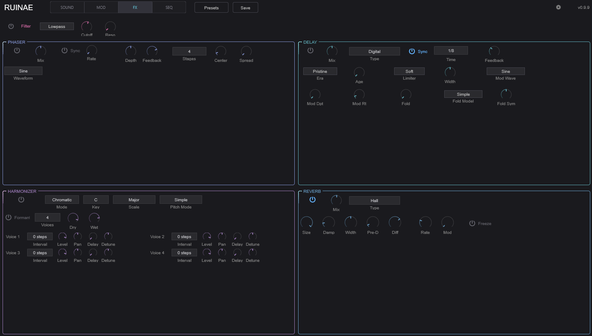

---

### Global Filter

<!-- IMG-25: Close-up of the global filter strip at the top of the FX tab -->


A stereo filter applied to the summed voice output before the effects chain. Useful for broad tonal shaping or as a modulation target for sweeping the entire mix.

| Control | Description |
|---------|-------------|
| **Enable** | Toggle the global filter on/off |
| **Type** | Filter response type |
| **Cutoff** | Filter cutoff frequency |
| **Reso** | Resonance amount |

---

### Phaser

<!-- IMG-26: Close-up of the Phaser section -->
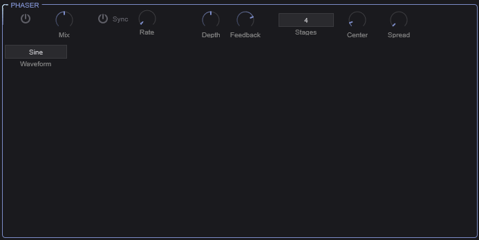

A stereo phaser effect that creates sweeping notches in the frequency spectrum through a series of all-pass filter stages.

| Control | Description |
|---------|-------------|
| **Enable** | Toggle phaser on/off |
| **Mix** | Dry/wet blend |
| **Rate** | Sweep speed (0.01–20 Hz), or tempo-synced |
| **Sync** | Lock rate to host tempo |
| **Note Value** | Tempo division when synced |
| **Depth** | Sweep range |
| **Feedback** | Signal fed back through the phaser stages — higher values create a more resonant, intense effect |
| **Stages** | Number of all-pass filter stages (2, 4, 6, 8, 10, or 12). More stages = more notches = more complex character. |
| **Center Freq** | Center frequency of the sweep range |
| **Stereo Spread** | Phase offset between left and right channels for stereo width |
| **Waveform** | LFO shape: Sine, Triangle, Square, or Sawtooth |

---

### Delay

<!-- IMG-27: Close-up of the Delay section showing the type dropdown and common controls. Show one of the type-specific views (e.g., Tape) -->
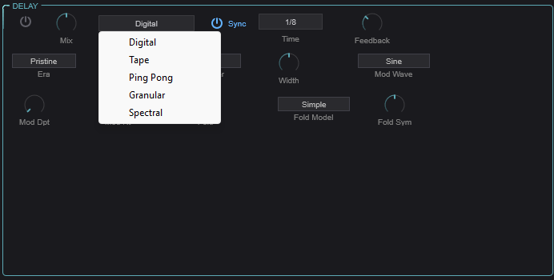

A versatile delay effect with five distinct delay types, each with its own character and controls.

#### Common Parameters

| Control | Description |
|---------|-------------|
| **Enable** | Toggle delay on/off |
| **Type** | Select delay type: Digital, Tape, Ping-Pong, Granular, or Spectral |
| **Time** | Delay time in milliseconds (or tempo-synced) |
| **Feedback** | Amount of signal fed back into the delay (0–120%). Values above 100% create runaway feedback — use with care. |
| **Mix** | Dry/wet blend |
| **Sync** | Lock delay time to host tempo |
| **Note Value** | Tempo division when synced |

#### Delay Types

##### Digital

<!-- IMG-28: Close-up of the Digital delay type-specific controls (switch to type-specific view) -->
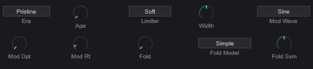

A clean or characterful digital delay with optional modulation and waveshaping in the feedback path.

| Control | Description |
|---------|-------------|
| **Era** | Digital model character (different eras of digital hardware) |
| **Age** | Component aging — adds subtle degradation |
| **Limiter** | Feedback path limiter character |
| **Mod Depth** | Chorus-like modulation depth |
| **Mod Rate** | Modulation speed |
| **Mod Waveform** | Modulation LFO shape |
| **Width** | Stereo width (0–200%) |
| **Wavefold Amount** | Wavefold distortion in the feedback path |
| **Wavefold Model** | Wavefold algorithm |
| **Wavefold Symmetry** | Symmetry of the wavefolding |

##### Tape

<!-- IMG-29: Close-up of the Tape delay type-specific controls showing the three tape head controls -->
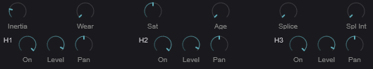

Models the warm, wobbly character of analog tape echo machines with three independent playback heads.

| Control | Description |
|---------|-------------|
| **Motor Inertia** | Simulates the physical mass of the tape transport — affects how the delay time responds to changes |
| **Wear** | Tape wear/degradation amount |
| **Saturation** | Tape saturation in the feedback path |
| **Age** | Overall aging of the tape machine |
| **Splice** | Enable tape splice artifacts |
| **Splice Intensity** | Intensity of splice artifacts |

Each of the **three tape heads** has:

| Control | Description |
|---------|-------------|
| **Enabled** | Toggle this head on/off |
| **Level** | Playback level (-96 to +6 dB) |
| **Pan** | Stereo position (-100 to +100) |

##### Ping-Pong

A stereo ping-pong delay that bounces the signal between left and right channels.

| Control | Description |
|---------|-------------|
| **L/R Ratio** | Timing ratio between left and right taps |
| **CrossFeed** | Amount of signal crossing between L and R channels |
| **Width** | Stereo spread |
| **Mod Depth** | Delay time modulation depth |
| **Mod Rate** | Modulation speed |

##### Granular

<!-- IMG-30: Close-up of the Granular delay type-specific controls -->
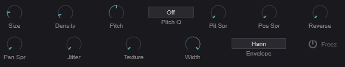

A granular delay that chops the delayed signal into grains and reassembles them, allowing for pitch-shifting, time-stretching, and textural effects in the delay path.

| Control | Description |
|---------|-------------|
| **Size** | Grain size (10–500 ms) |
| **Density** | Grains per second (1–100) |
| **Pitch** | Grain pitch transposition (-24 to +24 semitones) |
| **Pitch Spray** | Random pitch variation per grain |
| **Pitch Quant** | Quantize grain pitch to a scale |
| **Position Spray** | Random variation in grain read position |
| **Reverse Prob** | Probability that a grain plays in reverse |
| **Pan Spray** | Random stereo panning per grain |
| **Jitter** | Timing randomness |
| **Texture** | Tonal character of the grains |
| **Width** | Stereo width |
| **Envelope** | Grain amplitude envelope shape |
| **Freeze** | Freeze the delay buffer — new input is ignored, grains play from frozen content |

##### Spectral

<!-- IMG-31: Close-up of the Spectral delay type-specific controls -->
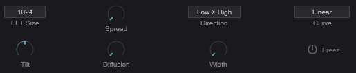

An FFT-based delay that operates in the frequency domain, allowing different frequency bands to be delayed by different amounts.

| Control | Description |
|---------|-------------|
| **FFT Size** | Analysis window size (512, 1024, 2048, or 4096). Larger = better frequency resolution but more latency. |
| **Spread** | Maximum delay spread across frequency bands (0–2000 ms) |
| **Direction** | Whether low or high frequencies are delayed more |
| **Curve** | Shape of the delay-time-vs-frequency curve |
| **Tilt** | Spectral balance tilt (-1 to +1) |
| **Diffusion** | Smears the spectral content over time |
| **Width** | Stereo width |
| **Freeze** | Freeze the spectral buffer |

---

### Harmonizer

<!-- IMG-32: Close-up of the Harmonizer section showing the global controls and per-voice harmony settings -->
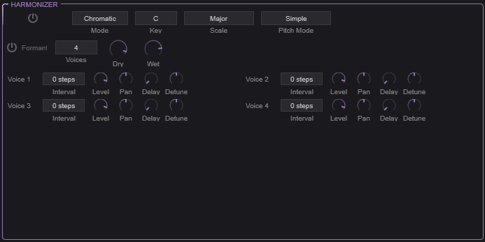

A polyphonic pitch-shifting harmonizer that adds up to four harmony voices to the signal, with optional formant preservation.

#### Global Controls

| Control | Description |
|---------|-------------|
| **Enable** | Toggle harmonizer on/off |
| **Mode** | **Chromatic**: Intervals are in semitones. **Scalic**: Intervals follow a musical scale. |
| **Key** | Musical key (C through B) — used with Scalic mode |
| **Scale** | Scale type (Major, Minor, etc.) — used with Scalic mode |
| **Pitch Mode** | Pitch-shifting algorithm |
| **Formant Preserve** | When enabled, preserves vocal formants during pitch shifting so voices sound natural rather than "chipmunk" at high intervals |
| **Num Voices** | Number of harmony voices (1–4) |
| **Dry Level** | Level of the unprocessed signal |
| **Wet Level** | Level of the harmonized voices |

#### Per-Voice Controls

Each of the four harmony voices has:

| Control | Description |
|---------|-------------|
| **Interval** | Pitch interval (semitones in Chromatic mode, scale degrees in Scalic mode) |
| **Level** | Volume of this harmony voice |
| **Pan** | Stereo position |
| **Delay** | Timing offset from the dry signal |
| **Detune** | Fine pitch offset for a more natural, chorus-like quality |

**Tip:** For a simple octave-up shimmer effect, set one voice to +12 semitones with low wet level and some reverb. For thick harmonies, use 3–4 voices in Scalic mode with slight detune and pan spread on each.

---

### Reverb

<!-- IMG-33: Close-up of the Reverb section showing type selector and all knobs -->
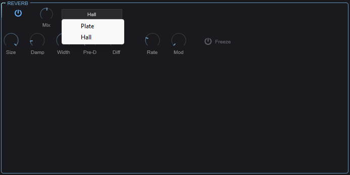

A stereo reverb with two algorithm types for spatial processing.

| Control | Description |
|---------|-------------|
| **Enable** | Toggle reverb on/off |
| **Type** | **Plate**: Bright, dense reflections inspired by plate reverbs. **Hall**: Larger, more diffuse space. |
| **Size** | Room/plate size — controls the overall decay time |
| **Damping** | High-frequency absorption. Higher values create a darker, more natural decay. |
| **Width** | Stereo width of the reverb output |
| **Mix** | Dry/wet blend |
| **Pre-Delay** | Time before the first reflections arrive. Separates the dry signal from the reverb tail for clarity. |
| **Diffusion** | Density of early reflections. Higher values create a smoother, more blended reverb. |
| **Freeze** | Freeze the reverb tail — the current decay sustains indefinitely while new input is muted. Great for ambient textures. |
| **Mod Rate** | Internal modulation speed — subtle pitch modulation within the reverb to reduce metallic artifacts |
| **Mod Depth** | Intensity of internal modulation |

---

## SEQ Tab

The SEQ tab contains two rhythm/pattern tools: the Trance Gate (a rhythmic amplitude gate) and the Arpeggiator (a full-featured step sequencer and note generator).

<!-- IMG-34: Full screenshot of the SEQ tab showing the Trance Gate at the top and the Arpeggiator below -->
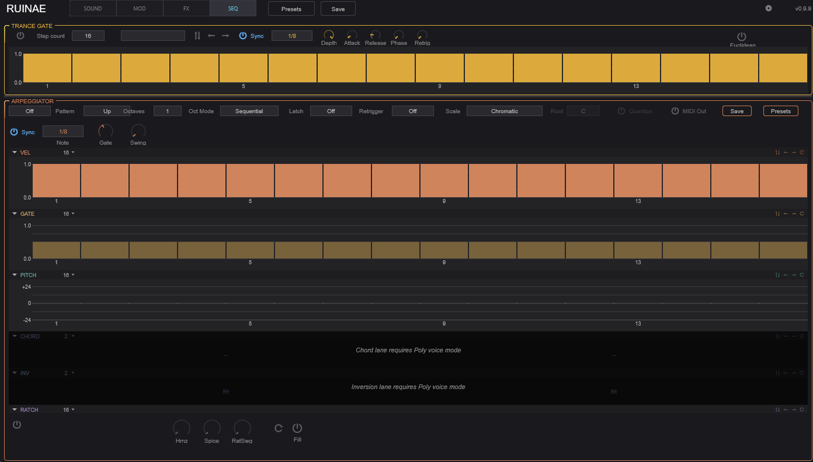

---

### Trance Gate

<!-- IMG-35: Close-up of the Trance Gate section showing the step pattern editor, controls, and euclidean options -->
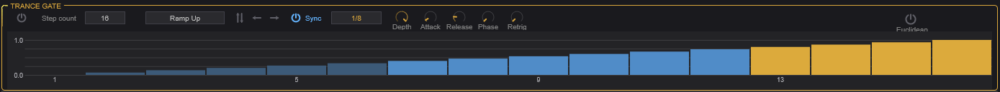

The Trance Gate is a rhythmic volume gate applied to each voice. It modulates the amplitude in a repeating step pattern, creating rhythmic chopping, stutter, and gating effects.

#### Controls

| Control | Description |
|---------|-------------|
| **Enable** | Toggle the trance gate on/off |
| **Steps** | Number of active steps in the pattern (2–32) |
| **Preset** | Load a preset gate pattern |
| **Sync** | Lock the gate rate to host tempo |
| **Rate** | Gate speed when not synced (0.1–50 Hz) |
| **Note Value** | Step length when synced (e.g., 1/16 note) |
| **Depth** | How deep the gating cuts — at 100%, silent steps are fully silent; lower values just reduce the volume |
| **Attack** | Fade-in time for each gate opening (1–20 ms). Prevents clicks. |
| **Release** | Fade-out time for each gate closing (1–50 ms) |
| **Phase** | Phase offset of the gate pattern |
| **Retrigger** | Reset the pattern on each new note |

#### Step Pattern Editor

The visual step editor shows the gate pattern. Click on individual steps to set their level (0–100%). Taller bars mean louder; empty steps are gated.

#### Transform Buttons

| Button | Description |
|--------|-------------|
| **Invert** | Flips all step levels (loud becomes quiet, quiet becomes loud) |
| **Shift Left** | Rotates the pattern one step to the left |
| **Shift Right** | Rotates the pattern one step to the right |

#### Euclidean Mode

Enable the Euclidean toggle for algorithmically generated patterns based on Euclidean rhythm theory (evenly distributing a number of hits across a number of steps).

| Control | Description |
|---------|-------------|
| **Euclidean** | Toggle euclidean rhythm generation |
| **Regen** | Regenerate the euclidean pattern |
| **Hits** | Number of active hits to distribute (0–32) |
| **Rotation** | Rotate the generated pattern |

**Tip:** Euclidean rhythms with prime-number step counts (5, 7, 11, 13) often produce the most interesting patterns that don't feel like straight 4/4 time.

---

### Arpeggiator

<!-- IMG-36: Close-up of the Arpeggiator controls row (top area) showing the mode, octave, latch, and other dropdowns -->
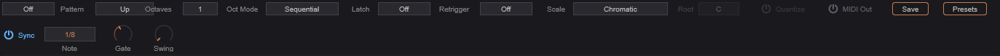

The Arpeggiator is a comprehensive step sequencer that can generate note patterns from held chords, modulate parameters, or both simultaneously. It features 32 steps with multiple independent lanes for detailed per-step control.

#### Operating Modes

| Mode | Description |
|------|-------------|
| **Off** | Arpeggiator is disabled |
| **MIDI** | Generates MIDI note patterns from held notes |
| **Mod** | Uses the lane data as modulation sources (routable via the mod matrix) without generating notes |
| **MIDI+Mod** | Both note generation and modulation output simultaneously |

#### Pattern Controls

| Control | Description |
|---------|-------------|
| **Mode** | Note order: Up, Down, Up-Down, Down-Up, Converge, Diverge, Random, Walk, As Played, or Chord |
| **Octave Range** | How many octaves the pattern spans (1–4) |
| **Oct Mode** | **Sequential**: Complete each octave before moving to the next. **Interleaved**: Alternate between octaves. |
| **Latch** | **Off**: Notes play only while keys are held. **Hold**: Pattern continues after keys are released. **Add**: New notes are added to the held pattern. |
| **Retrigger** | **Off**: Pattern runs continuously. **Note**: Restart on new note. **Beat**: Restart on beat. |

#### Timing Controls

| Control | Description |
|---------|-------------|
| **Sync** | Lock arp rate to host tempo |
| **Rate** | Step rate when not synced (0.5–50 Hz) |
| **Note Value** | Step length when synced |
| **Gate Length** | Note duration as percentage of step length (1–200%) |
| **Swing** | Timing shuffle (0–75%) — delays every other step for a groovy, non-straight feel |

#### Performance Controls

| Control | Description |
|---------|-------------|
| **Spice** | Random variation amount (0–100%) — adds controlled randomness to the pattern |
| **Humanize** | Random timing and velocity variation for a more human feel |
| **Fill** | Temporarily activates a fill pattern variation |
| **Dice** | Randomize the current pattern — press to generate a new random sequence |

#### Scale Controls

| Control | Description |
|---------|-------------|
| **Scale Type** | Musical scale to quantize notes to |
| **Root Note** | Root note of the scale |
| **Quantize Input** | When enabled, quantizes incoming MIDI notes to the selected scale before arpeggiation |
| **MIDI Out** | When enabled, the arpeggiator outputs MIDI notes that can be recorded or sent to other instruments |

---

### Step Lanes

<!-- IMG-37: Close-up of the arpeggiator step lanes showing at least the velocity and pitch lanes with visible step data -->
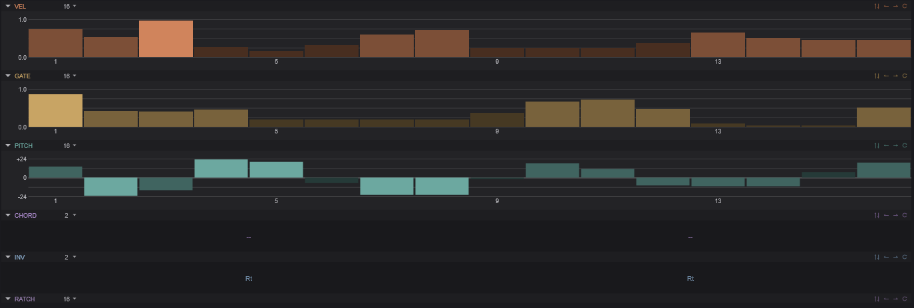

The arpeggiator's power comes from its multiple independent step lanes. Each lane has up to 32 steps and can have its own independent length, creating polymetric patterns when lanes have different lengths.

#### Velocity Lane

Per-step velocity control (0–100%). Determines how hard each note is played. Affects both the MIDI velocity and any velocity-sensitive parameters.

#### Gate Lane

Per-step gate length (1–200%). Controls how long each individual note is held, independent of the global gate length. Values above 100% create overlapping (legato) notes.

#### Pitch Lane

Per-step pitch transposition (-24 to +24 semitones). Adds a pitch offset to each step, turning the arpeggiator into a melodic sequencer.

#### Ratchet Lane

Per-step ratchet count (1–4). Determines how many times each step is retriggered within its time slot. A ratchet of 2 plays the note twice as fast, 3 plays triplets, etc.

| Related Control | Description |
|---------|-------------|
| **Ratchet Swing** | Timing variation between ratcheted notes — adds a shuffle feel to ratchets |

#### Modifier Lane

Per-step modifier value (0–255). A general-purpose lane that can represent accents, slides, or other per-step data.

| Related Control | Description |
|---------|-------------|
| **Accent Velocity** | Velocity boost applied to accented steps |
| **Slide Time** | Portamento time for steps marked as slides |

#### Condition Lane

Per-step playback condition (18 condition types). Each step can have a condition that determines whether it plays on a given cycle — for example, "play only on even cycles" or "50% probability." This creates evolving patterns that don't simply repeat.

#### Chord Lane

Per-step chord type. Each step can trigger a chord instead of a single note: None, Dyad, Triad, 7th, or 9th. Combined with the Scale controls, this creates harmonically aware chord progressions.

**Tip:** Set different lane lengths for polymetric sequences. For example, a 7-step pitch lane with a 16-step velocity lane creates a pattern that doesn't fully repeat for 112 steps (7 × 16).

---

## Settings

<!-- IMG-38: Screenshot of the settings drawer slid open from the right side of the plugin -->
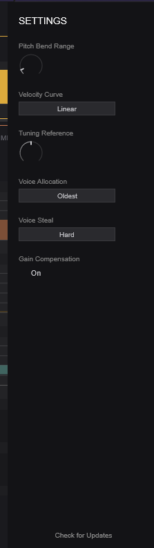

Access the settings drawer by clicking the gear icon in the top bar. These settings affect the plugin's global behavior.

| Setting | Description |
|---------|-------------|
| **Pitch Bend Range** | Range of the MIDI pitch bend wheel in semitones |
| **Velocity Curve** | How MIDI velocity maps to internal velocity (linear, soft, hard, etc.) |
| **Tuning Reference** | Concert pitch reference frequency (default: 440 Hz) |
| **Voice Allocation** | How new voices are assigned: Round Robin, Oldest, Lowest Velocity, or Highest Note |
| **Voice Steal Mode** | Which voice is stolen when polyphony is exceeded |
| **Gain Compensation** | Automatic volume compensation based on active voice count |

---

## Tips & Techniques

### Layering Oscillators
Use contrasting oscillator types for the richest results. A tonal oscillator (PolyBLEP, Additive) layered with a textural one (Particle, Chaos, Noise) gives you both pitch and character. Use the Spectral Morph mode to blend them in the frequency domain rather than just crossfading.

### Modulation Depth
Start with subtle modulation amounts and increase gradually. It's easier to add complexity than to dial it back. The Smooth parameter in the mod matrix is your friend — it prevents modulation from sounding jittery or harsh.

### Using the Arpeggiator as a Modulator
Set the arpeggiator to **Mod** mode to use its lanes as modulation sources without generating notes. Route the Velocity Lane or Modifier Lane through the mod matrix to create complex, rhythmic parameter automation that stays perfectly in sync with your tempo.

### Feedback Safety
Ruinae allows delay feedback above 100%. This creates self-oscillating, runaway effects that can get very loud. The Soft Limiter (in the Master section) helps prevent damage, but use high feedback values intentionally and with care.

### CPU Management
If CPU usage is high, try reducing the polyphony count in the Master section. Many sounds work well with 4–6 voices instead of the default 8. Also, disable any effects you're not using — each active effect consumes resources even at 0% mix.
