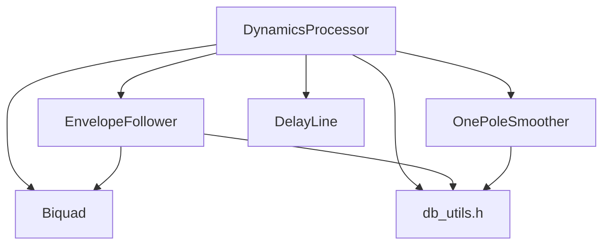

# Implementation Plan: DynamicsProcessor (Compressor/Limiter)

**Branch**: `011-dynamics-processor` | **Date**: 2025-12-23 | **Spec**: [spec.md](spec.md)
**Input**: Feature specification from `/specs/011-dynamics-processor/spec.md`

## Summary

A Layer 2 DSP Processor implementing dynamics processing (compression/limiting) that uses EnvelopeFollower for level detection and applies gain reduction based on threshold, ratio, knee, attack/release timing, with optional lookahead for transparent limiting.

## Technical Context

**Language/Version**: C++20 (per Constitution Principle III)
**Primary Dependencies**:
- EnvelopeFollower (Layer 2 - level detection)
- OnePoleSmoother (Layer 1 - gain smoothing)
- DelayLine (Layer 1 - lookahead buffer)
- Biquad (Layer 1 - sidechain filter)
- dbToGain/gainToDb (Layer 0 - dB conversions)

**Storage**: N/A (stateful processor, no persistence)
**Testing**: Catch2 (per existing test infrastructure)
**Target Platform**: Windows (MSVC), macOS (Clang), Linux (GCC)
**Project Type**: Single project (VST3 plugin DSP library)
**Performance Goals**: < 0.5% CPU per instance at 44.1kHz stereo (Layer 2 design target; SC-009 acceptance threshold is < 1%)
**Constraints**:
- Real-time safe: noexcept, no allocations in process()
- All timing within 5% of specified time constants (SC-002)
- Gain reduction accuracy within 0.1 dB (SC-001)

**Scale/Scope**: Single processor class with ~500 LOC header

## Constitution Check

*GATE: Must pass before Phase 0 research. Re-check after Phase 1 design.*

| Principle | Relevant? | Status | Notes |
|-----------|-----------|--------|-------|
| I. VST3 Separation | No | N/A | Pure DSP, not VST integration |
| II. Real-Time Safety | Yes | PASS | Will use noexcept, pre-allocated buffers |
| III. Modern C++ | Yes | PASS | C++20, RAII, constexpr |
| IV. SIMD/DSP | Yes | PASS | Sequential memory access in process loop |
| V. VSTGUI | No | N/A | No UI in this spec |
| VI. Memory Architecture | Yes | PASS | Pre-allocate lookahead buffer in prepare() |
| VII. Project Structure | Yes | PASS | src/dsp/processors/ for Layer 2 |
| VIII. Testing | Yes | PASS | Unit tests in tests/unit/processors/ |
| IX. Layered Architecture | Yes | PASS | Layer 2, depends on Layer 0-1 plus peer Layer 2 (EnvelopeFollower) |
| X. DSP Constraints | Yes | PASS | Sample-accurate timing, denormal handling |
| XI. Performance Budgets | Yes | PASS | < 0.5% CPU target for Layer 2 |
| XII. Test-First | Yes | PASS | Tests before implementation |
| XIII. Architecture Docs | Yes | PENDING | Update ARCHITECTURE.md at completion |
| XIV. ODR Prevention | Yes | PASS | See Codebase Research section |
| XV. Honest Completion | Yes | PENDING | Verify at completion |

**Required Check - Principle XII (Test-First Development):**
- [x] Tasks will include TESTING-GUIDE.md context verification step
- [x] Tests will be written BEFORE implementation code
- [x] Each task group will end with a commit step

**Required Check - Principle XIV (ODR Prevention):**
- [x] Codebase Research section below is complete
- [x] No duplicate classes/functions will be created

## Codebase Research (Principle XIV - ODR Prevention)

*GATE: Must complete BEFORE creating any new classes, structs, or functions.*

### Mandatory Searches Performed

**Classes/Structs to be created**: DynamicsProcessor

| Planned Type | Search Command | Existing? | Action |
|--------------|----------------|-----------|--------|
| DynamicsProcessor | `grep -r "class.*Dynamics" src/` | No | Create New |
| Compressor | `grep -r "class.*Compressor" src/` | No | Create New (DynamicsProcessor) |
| Limiter | `grep -r "class.*Limiter" src/` | No | Create New (DynamicsProcessor) |
| GainComputer | `grep -r "GainComputer" src/` | No | Internal to DynamicsProcessor |

**Utility Functions to be created**: None (reuse existing Layer 0)

| Planned Function | Search Command | Existing? | Location | Action |
|------------------|----------------|-----------|----------|--------|
| computeGainReduction | N/A | No | Will be method | Create as DynamicsProcessor method |

### Existing Components to Reuse

| Component | Location | Layer | How It Will Be Used |
|-----------|----------|-------|---------------------|
| dbToGain | dsp/core/db_utils.h | 0 | Convert threshold/makeup from dB to linear |
| gainToDb | dsp/core/db_utils.h | 0 | Convert detected level to dB for gain calculation |
| constexprExp | dsp/core/db_utils.h | 0 | N/A (EnvelopeFollower handles coefficients) |
| flushDenormal | dsp/core/db_utils.h | 0 | Prevent denormal accumulation in gain state |
| isNaN/isInf | dsp/core/db_utils.h | 0 | Input sanitization |
| EnvelopeFollower | dsp/processors/envelope_follower.h | 2 | Level detection with attack/release |
| OnePoleSmoother | dsp/primitives/smoother.h | 1 | Smooth gain reduction to prevent clicks |
| DelayLine | dsp/primitives/delay_line.h | 1 | Lookahead buffer for audio path |
| Biquad | dsp/primitives/biquad.h | 1 | Sidechain highpass filter |

### Files Checked for Conflicts

- [x] `src/dsp/dsp_utils.h` - Contains old utilities (VSTWork namespace), no conflicts
- [x] `src/dsp/core/` - Layer 0 utilities, will reuse db_utils.h
- [x] `src/dsp/processors/` - Contains EnvelopeFollower, no Dynamics* classes
- [x] `ARCHITECTURE.md` - No DynamicsProcessor documented

### ODR Risk Assessment

**Risk Level**: Low

**Justification**: No existing DynamicsProcessor, Compressor, or Limiter classes in codebase. All required utilities exist in Layer 0/1 and will be reused. The only new class is DynamicsProcessor in the Iterum::DSP namespace.

## Project Structure

### Documentation (this feature)

```text
specs/011-dynamics-processor/
├── spec.md              # Feature specification
├── plan.md              # This file
├── data-model.md        # Phase 1: Data model and parameters
├── quickstart.md        # Phase 1: Usage examples
├── contracts/           # Phase 1: API contract
│   └── dynamics_processor.h  # Header contract
└── tasks.md             # Phase 2: Implementation tasks
```

### Source Code (repository root)

```text
src/dsp/
├── core/
│   └── db_utils.h           # Layer 0: dB utilities (existing)
├── primitives/
│   ├── delay_line.h         # Layer 1: Lookahead buffer (existing)
│   ├── smoother.h           # Layer 1: Gain smoothing (existing)
│   └── biquad.h             # Layer 1: Sidechain filter (existing)
└── processors/
    ├── envelope_follower.h  # Layer 2: Level detection (existing)
    └── dynamics_processor.h # Layer 2: NEW - This spec

tests/unit/
└── processors/
    └── dynamics_processor_test.cpp  # NEW - Unit tests
```

**Structure Decision**: Single new header file in existing src/dsp/processors/ directory with corresponding test file.

## Technical Design

### Gain Reduction Algorithm

The core gain reduction formula (hard knee):
```
if (inputLevel_dB > threshold_dB):
    reduction_dB = (inputLevel_dB - threshold_dB) * (1 - 1/ratio)
else:
    reduction_dB = 0
```

For soft knee (quadratic interpolation in knee region):
```
kneeStart = threshold - kneeWidth/2
kneeEnd = threshold + kneeWidth/2

if (inputLevel_dB < kneeStart):
    reduction_dB = 0
elif (inputLevel_dB > kneeEnd):
    reduction_dB = (inputLevel_dB - threshold) * (1 - 1/ratio)
else:
    # Quadratic interpolation in knee region
    x = inputLevel_dB - kneeStart
    reduction_dB = (1 - 1/ratio) * (x * x) / (2 * kneeWidth)
```

### Auto-Makeup Gain Calculation

For input at 0 dB (typical program material peak):
```
autoMakeup_dB = -threshold * (1 - 1/ratio)
```

This compensates for the gain reduction that would occur at 0 dB input.

### Lookahead Implementation

Lookahead allows gain reduction to begin before transients arrive:
1. Audio path goes through DelayLine (lookahead delay)
2. Detection path uses undelayed signal
3. Gain reduction is applied to the delayed audio

```
          ┌─────────────┐
Input ──┬─│ DelayLine   │──┬── Output = delayed * gainReduction
        │ │ (lookahead) │  │
        │ └─────────────┘  │
        │                  │
        │ ┌─────────────┐  │
        └─│ Envelope    │──┴── gainReduction = f(envelope, threshold, ratio, knee)
          │ Follower    │
          └─────────────┘
```

### Sidechain Filter

The sidechain highpass filter is applied to the detection path only, not the audio path. This prevents low frequencies from triggering excessive gain reduction (reduces "pumping" on bass-heavy material).

## Complexity Tracking

No constitution violations requiring justification.

## Dependencies



## Risk Assessment

| Risk | Probability | Impact | Mitigation |
|------|-------------|--------|------------|
| Attack/release timing accuracy | Medium | High | Use EnvelopeFollower's proven timing |
| Soft knee discontinuity | Low | Medium | Verify derivative continuity in tests |
| Lookahead latency reporting | Low | Low | Simple sample count calculation |
| Mode switching clicks | Medium | Medium | Use OnePoleSmoother for gain changes |
